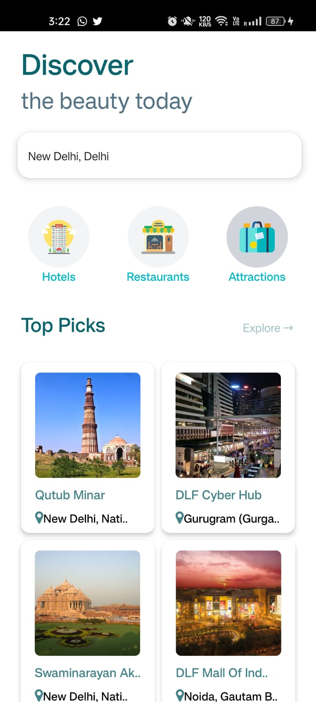

# Go Travel 

## About

Go Travel is a React Native application that allows you to search for nearby places of interest such as restaurants, hotels, and attractions. It utilizes Rapid API for fetching data and TomTom API for implementing the autocomplete search feature.

## Installation

- Clone the repository
- Install the required dependencies using `npm install`
- Start the application using `expo start`

## Technologies Used

- React Native
- Expo
- Rapid API
- TomTom API

## Screenshots:

